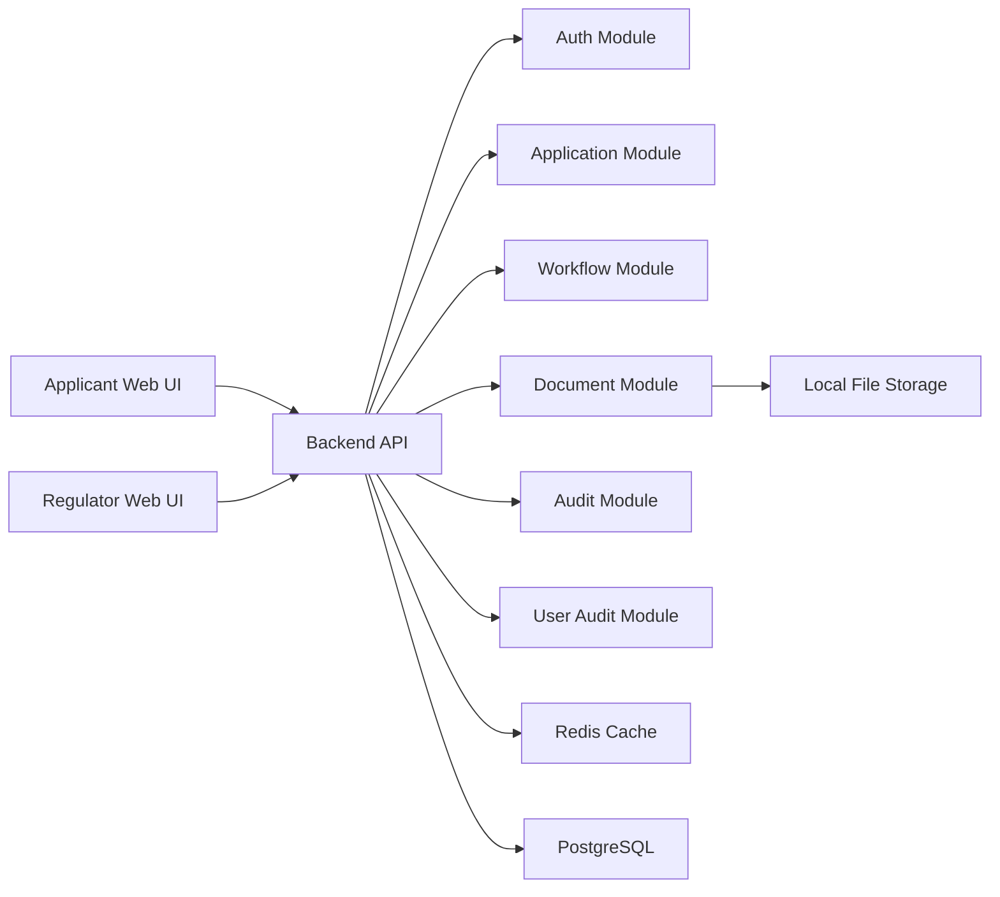
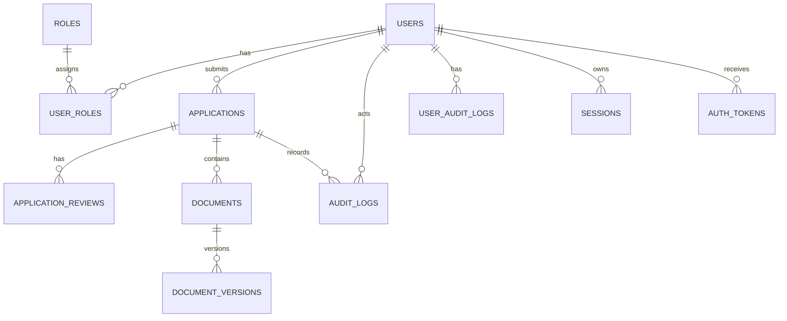

# Bank Licensing & Compliance Portal Design Document

## 1. Problem framing

The National Bank of Rwanda currently manages bank and financial institution licensing through email, spreadsheets, and informal approval paths. That model creates four critical risks:

1. No reliable system of record for applications and their current state.
2. Weak separation of duties between review and final approval.
3. No tamper-resistant audit history suitable for regulatory or legal scrutiny.
4. High operational risk from manual coordination, lost documents, and ambiguous status.

This system should therefore optimize for correctness, traceability, and defensible business rules before optimizing for breadth of features or visual polish.

## 2. Design goals

### Primary goals

1. Provide a single authoritative record for each application from draft to final decision.
2. Enforce workflow rules and role boundaries in the backend.
3. Maintain an append-only audit trail that is difficult to tamper with and easy to inspect.
4. Preserve document history across re-submissions and information requests.
5. Prevent inconsistent state under concurrent access.
6. Remain small enough to implement cleanly in an assessment setting.

### Non-goals for the first implementation

1. External identity providers or SSO.
2. Cloud object storage, OCR, antivirus scanning, or document classification.
3. Multi-channel notification infrastructure (SMS, push, inbox digests, escalations). The first implementation still includes essential transactional workflow emails.
4. Multi-tenancy across regulators or jurisdictions.
5. Complex BPM/workflow tooling.

Those are valid future extensions, but they would add complexity without improving the core evaluation criteria for this challenge.

## 3. Guiding principles

1. Backend is the source of truth for permissions, transitions, and finality.
2. Database constraints should backstop application logic for critical invariants.
3. Final decisions must be irreversible at both application and data-access levels.
4. Audit evidence must be additive, not mutable.
5. Prefer a modular monolith over microservices for this scope.
6. Every ambiguous business rule should become an explicit, documented decision.

### 3.1 Explicit decisions under ambiguity

The challenge intentionally leaves business details open. These are the implementation decisions this design makes:

1. One application belongs to one applicant user acting on behalf of one institution.
2. One application has one active reviewer at a time and one final approver.
3. Reviewers and approvers can see all non-draft applications because they represent the regulator.
4. Applicants enter the system through public self-registration and can only see their own applications and documents.
5. Reviewer notes are internal by default, except explicit information-request notes intended for the applicant.
6. Both approval and rejection require a written decision reason.
7. Only explicit workflow actions can mutate state. There is no generic admin override for state changes.
8. Submitted and finalised records are never hard-deleted.
9. Timestamps are generated server-side and stored in database datetime columns. UI rendering follows user locale.
10. Document types are a controlled enum in the first version: `BUSINESS_PLAN`, `CERTIFICATE_OF_INCORPORATION`, `SHAREHOLDING_STRUCTURE`, `CAPITAL_ADEQUACY_EVIDENCE`, `GOVERNANCE_DOCUMENT`, and `SUPPORTING_DOCUMENT`.

## 4. Proposed architecture

### 4.1 Architecture choice

Use a split frontend/backend architecture with two separate repositories:

- Frontend app: `React` + `TypeScript` + `Vite` + `TanStack Router` + `TanStack Query`
- Backend app: `Node.js` + `TypeScript` + `Express` + `Sequelize ORM` + `Joi/celebrate`
- Database: `PostgreSQL`
- Cache store: `Redis`
- Session store: PostgreSQL-backed server sessions
- File storage: local filesystem for binaries plus PostgreSQL metadata
- API documentation: generated `OpenAPI`

This is a split frontend/backend architecture. The browser client and API live in separate repositories, communicate over HTTP, and share the same PostgreSQL database.

### 4.2 Repository structure

The solution is delivered as two repositories:

```text
/bnr-licensing-fe
/bnr-licensing-be
```

- `bnr-licensing-fe` contains the React user interface for applicants and regulators.
- `bnr-licensing-be` contains the Express API, business rules, authentication, workflow enforcement, database access, seed scripts, and API documentation.
- The governing design document is maintained in frontend and mirrored to backend `docs/` for implementation reference.
- The API contract is defined in the backend OpenAPI spec.

### 4.3 Why a modular monolith

This is a high-stakes but relatively bounded internal system. A modular monolith is the right trade-off because it:

1. Keeps transactional consistency simple. Workflow transitions, audit writes, and document metadata updates can happen in one database transaction.
2. Reduces accidental complexity. Microservices would create unnecessary operational, testing, and consistency overhead for an assessment project.
3. Preserves good boundaries. We can still separate modules by domain: auth, users, applications, workflow, documents, audit, and reporting.
4. Is easier to run locally for reviewers. One backend, one frontend, one database, one Redis instance, one seed path.

### 4.4 Logical components



### 4.5 Module responsibilities

- `Auth module`
  - applicant registration, email verification, invited-user password setup, login, logout, session validation, role lookup
- `User module`
  - user records, role assignment, active/inactive status
- `Application module`
  - create, retrieve, update, and submit applications
- `Workflow module`
  - valid transitions, state guards, reviewer/approver separation, concurrency checks
- `Notification module`
  - workflow-triggered transactional email notifications and template rendering
- `Document module`
  - file upload validation, metadata persistence, document version history
- `Audit module`
  - immutable application-event capture and retrieval
- `User audit module`
  - immutable user onboarding audit events (`APPLICANT_REGISTERED`, `APPLICANT_EMAIL_VERIFIED`)

### 4.6 Redis caching strategy

The backend uses `Redis` for short-lived performance caching. It is not used as a source of truth for regulatory records.

Redis is used for:

1. application list caching,
2. application detail caching,
3. short-lived aggregation caching for counts,
4. login attempt throttling counters.

Redis is not used for:

1. workflow transition enforcement,
2. authorization decisions on mutating actions,
3. audit log persistence,
4. final decision records,
5. session storage.

### 4.7 Cache design decisions

Use a cache-aside strategy with explicit invalidation.

Cached keys:

1. `applications:list:{role}:{userId}:{filter}`
2. `application:details:{applicationId}`
3. `applications:count:{role}:{userId}:{filter}`

Time-to-live:

1. application lists: 60 seconds
2. application detail: 30 seconds
3. dashboard counts: 30 seconds

Invalidation rules:

1. any application state transition invalidates detail/list/count caches,
2. document upload invalidates detail/list/count caches,
3. internal user status changes invalidate list/count caches.

## 5. Authentication and authorization

### 5.1 Authentication decision: session-based auth

Use server-managed sessions stored in PostgreSQL and sent to the browser via secure `HttpOnly` cookies.

### 5.2 Why session-based auth instead of JWT

For this portal, session auth is the better fit because:

1. Revocation is straightforward.
2. Sensitive permissions do not live in long-lived client-held tokens.
3. It simplifies backend enforcement in a same-organization web app.
4. It reduces stale authorization risk after role/status changes.

### 5.3 Session security controls

- `HttpOnly`, `Secure` (production/staging), `SameSite=Strict` cookies
- `bcrypt` password hashing
- server-side session expiration and rotation on login
- CSRF protection for state-changing requests
- throttle after repeated failed logins
- one-time verification and invitation tokens with expiry timestamps

### 5.4 Email delivery approach

The system includes transactional emails for:

1. applicant email verification,
2. internal user invitation/password setup,
3. reviewer notification when an application is submitted,
4. applicant notification when information is requested,
5. approver notification when an application is ready for decision,
6. applicant notification for final decision outcome.

Implementation uses backend templates + delivery adapter (`Resend` configured).

### 5.4.1 Workflow notification triggers

1. `DRAFT -> SUBMITTED`: email all active reviewers.
2. `UNDER_REVIEW -> INFO_REQUESTED`: email applicant with request summary.
3. `UNDER_REVIEW -> READY_FOR_DECISION`: email all active approvers.
4. `READY_FOR_DECISION -> APPROVED|REJECTED`: email applicant with decision summary.

### 5.5 User onboarding and registration model

Two distinct onboarding paths:

1. `Applicants` self-register publicly and must verify email.
2. `Reviewers`, `Approvers`, and `Admins` are invited by admin and complete password setup via one-time link.

### 5.6 Applicant registration and email verification flow

1. User opens public registration page.
2. User submits full name, email address, institution name, password.
3. Frontend validates with `zod`; backend validates with `celebrate/Joi`.
4. Backend creates user with role `APPLICANT` and status `PENDING_EMAIL_VERIFICATION`.
5. Backend stores password hash and one-time verification token hash.
6. Backend writes `APPLICANT_REGISTERED` user audit event.
7. Verification email is sent.
8. User clicks verification link.
9. Backend validates token, activates user, consumes token.
10. Backend writes `APPLICANT_EMAIL_VERIFIED` user audit event.
11. Backend creates session and returns authenticated profile.

### 5.7 Regulator account provisioning and password setup

1. Admin invites internal user (`REVIEWER`, `APPROVER`, `ADMIN`).
2. Backend creates account in `PENDING_PASSWORD_SETUP`.
3. Backend issues one-time password setup token.
4. Email is sent using configured `app.resetPasswordUri`.
5. User sets password through `/set-password` route.
6. Account becomes `ACTIVE`.

## 6. Roles and permission boundaries

### 6.1 Roles

1. `APPLICANT`
2. `REVIEWER`
3. `APPROVER`
4. `ADMIN`
5. `SUPER_ADMIN` (supported by role model and admin route guard)

### 6.2 Why these roles

- Applicant submits licensing material.
- Reviewer performs substantive review.
- Approver makes final decision.
- Admin manages operations and internal accounts.
- Super admin is reserved for higher privilege operations without changing workflow boundaries.

### 6.3 Permission matrix

| Action | Applicant | Reviewer | Approver | Admin | Super Admin |
|---|---|---|---|---|---|
| Public self-registration | Yes | No | No | No | No |
| Verify own email | Yes | No | No | No | No |
| Create/edit own draft | Yes | No | No | No | No |
| Submit/resubmit own application | Yes | No | No | No | No |
| View own applications | Yes | No | No | No | No |
| View non-draft queue | No | Yes | Yes | Yes | Yes |
| Start review | No | Yes | No | No | No |
| Request information | No | Yes | No | No | No |
| Mark ready for decision | No | Yes | No | No | No |
| Approve/reject | No | No | Yes | No | No |
| Invite internal user | No | No | No | Yes | Yes |
| Update internal user status | No | No | No | Yes | Yes |

### 6.4 Critical boundary: reviewer cannot be approver

Enforced in:

1. workflow service guard,
2. DB check constraint,
3. UI action visibility (decision action hidden when approver is recorded reviewer).

## 7. Application lifecycle and state machine

### 7.1 States

1. `DRAFT`
2. `SUBMITTED`
3. `UNDER_REVIEW`
4. `INFO_REQUESTED`
5. `RESUBMITTED`
6. `READY_FOR_DECISION`
7. `APPROVED`
8. `REJECTED`

### 7.2 State definitions

- `DRAFT`: editable by applicant.
- `SUBMITTED`: awaiting reviewer start.
- `UNDER_REVIEW`: active review cycle.
- `INFO_REQUESTED`: reviewer requested targeted changes.
- `RESUBMITTED`: applicant responded to request.
- `READY_FOR_DECISION`: review complete, awaiting approver decision.
- `APPROVED`: final positive terminal state.
- `REJECTED`: final negative terminal state.

### 7.3 Valid transitions

| From | To | Allowed actor | Rule |
|---|---|---|---|
| `DRAFT` | `SUBMITTED` | Applicant | Required fields + required docs present |
| `SUBMITTED` | `UNDER_REVIEW` | Reviewer | Starts review cycle |
| `RESUBMITTED` | `UNDER_REVIEW` | Reviewer | Starts re-review cycle |
| `UNDER_REVIEW` | `INFO_REQUESTED` | Reviewer | At least one typed request item |
| `UNDER_REVIEW` | `READY_FOR_DECISION` | Reviewer | Review notes completed |
| `INFO_REQUESTED` | `RESUBMITTED` | Applicant | Required request items satisfied |
| `READY_FOR_DECISION` | `APPROVED` | Approver | Approver must differ from reviewer |
| `READY_FOR_DECISION` | `REJECTED` | Approver | Approver must differ from reviewer |

### 7.4 Invalid transitions

Any transition not explicitly listed is rejected with conflict/validation response.

### 7.5 Terminal state rule

`APPROVED` and `REJECTED` are terminal and immutable.

### 7.6 State machine enforcement

1. Begin transaction.
2. Lock application row (`FOR UPDATE`).
3. Validate role, state, and lock version.
4. Write state mutation and audit row.
5. Commit transaction.

### 7.7 Additional information request model

`application_reviews` stores:

1. `request_items` (structured JSON),
2. `notes` (summary),
3. `completed_at` and `responded_at`,
4. `applicant_responses`.

Request types:

1. `FIELD_UPDATE`
2. `DOCUMENT_REPLACEMENT`
3. `ADDITIONAL_DOCUMENT`
4. `OPEN_QUESTION`

## 8. Concurrency and consistency design

### 8.1 Requirement

Concurrent actors must not cause invalid or ambiguous state.

### 8.2 Strategy

- pessimistic DB locking,
- optimistic `lock_version` checks.

### 8.3 Database-level control

Workflow mutations run in transaction with row lock and version validation.

### 8.4 API behavior under races

Winning request succeeds; losing stale request gets `409` with refresh/retry instruction.

### 8.5 Example race scenarios covered

1. dual reviewer start-review,
2. reviewer request-info vs mark-ready race,
3. dual approver decision race,
4. applicant resubmit vs internal transition race.

## 9. Data model

### 9.1 Entity overview

1. `users`
2. `roles`
3. `user_roles`
4. `applications`
5. `application_reviews`
6. `documents`
7. `document_versions`
8. `audit_logs`
9. `user_audit_logs`
10. `sessions`
11. `auth_tokens`

### 9.2 Entity relationship diagram



### 9.3 Proposed schema

#### users

| Column | Type | Notes |
|---|---|---|
| `id` | UUID | primary key |
| `email` | varchar unique | login identifier |
| `password` | varchar | hashed password |
| `name` | varchar | display name |
| `institution_name` | varchar | institution |
| `email_verified_at` | datetime nullable | applicant verification timestamp |
| `status` | enum | `PENDING_EMAIL_VERIFICATION`, `PENDING_PASSWORD_SETUP`, `ACTIVE`, `DISABLED` |
| `created_at` | datetime | |
| `updated_at` | datetime | |

#### roles

| Column | Type | Notes |
|---|---|---|
| `id` | UUID | primary key |
| `name` | enum | includes `SUPER_ADMIN` |
| `description` | varchar | |

#### user_roles

| Column | Type | Notes |
|---|---|---|
| `user_id` | UUID | FK users |
| `role_id` | UUID | FK roles |

#### applications

| Column | Type | Notes |
|---|---|---|
| `id` | UUID | primary key |
| `reference_number` | varchar unique | tracking reference |
| `applicant_id` | UUID | FK users |
| `institution_name` | varchar | |
| `institution_type` | enum | |
| `business_address` | varchar nullable | |
| `contact_name` | varchar nullable | |
| `contact_email` | varchar nullable | |
| `contact_phone` | varchar nullable | |
| `license_category` | varchar nullable | |
| `license_category_other_details` | varchar nullable | |
| `capital_amount_rwf` | decimal nullable | |
| `incorporation_date` | date nullable | |
| `business_summary` | text nullable | |
| `current_state` | enum | lifecycle state |
| `submitted_at` | datetime nullable | |
| `reviewed_by_id` | UUID nullable | |
| `decisioned_by_id` | UUID nullable | |
| `decision_at` | datetime nullable | |
| `decision_reason` | string nullable | required in final states |
| `lock_version` | integer | optimistic concurrency counter |
| `created_at` | datetime | |
| `updated_at` | datetime | |

#### application_reviews

| Column | Type | Notes |
|---|---|---|
| `id` | UUID | primary key |
| `application_id` | UUID | FK applications |
| `reviewer_id` | UUID | FK users |
| `cycle_number` | integer | review cycle |
| `started_at` | datetime | |
| `completed_at` | datetime nullable | |
| `outcome` | enum nullable | `INFO_REQUESTED`, `READY_FOR_DECISION` |
| `notes` | string nullable | |
| `request_items` | jsonb/json nullable | structured request list |
| `applicant_responses` | jsonb/json nullable | structured responses |
| `responded_at` | datetime nullable | |

#### documents

| Column | Type | Notes |
|---|---|---|
| `id` | UUID | primary key |
| `application_id` | UUID | FK applications |
| `document_type` | enum | controlled document type |
| `created_at` | datetime | |

#### document_versions

| Column | Type | Notes |
|---|---|---|
| `id` | UUID | primary key |
| `document_id` | UUID | FK documents |
| `version_number` | integer | monotonic per document |
| `stored_filename` | string | randomized UUID filename |
| `original_filename` | string | client filename |
| `mime_type` | string | expected PDF |
| `file_size_bytes` | integer | |
| `checksum` | string | SHA-256 |
| `uploaded_by_id` | UUID | FK users |
| `uploaded_at` | datetime | |
| `supersedes_version_id` | UUID nullable | version lineage |

#### audit_logs

| Column | Type | Notes |
|---|---|---|
| `id` | UUID | primary key |
| `application_id` | UUID | FK applications |
| `acting_user_id` | UUID | FK users |
| `action_type` | enum | workflow action |
| `occurred_at` | datetime | |
| `before_state` | string nullable | |
| `after_state` | string nullable | |
| `request_id` | string unique | trace identifier |
| `ip_address` | string nullable | |
| `user_agent` | string nullable | |
| `metadata` | jsonb/json | action metadata |
| `previous_hash` | string nullable | hash chain |
| `entry_hash` | string | hash chain |

#### user_audit_logs

| Column | Type | Notes |
|---|---|---|
| `id` | UUID | primary key |
| `user_id` | UUID | FK users |
| `action_type` | enum | onboarding audit action |
| `occurred_at` | datetime | |
| `request_id` | string unique | trace identifier |
| `ip_address` | string nullable | |
| `user_agent` | string nullable | |
| `metadata` | jsonb/json | event metadata |
| `previous_hash` | string nullable | hash chain |
| `entry_hash` | string | hash chain |

#### sessions

| Column | Type | Notes |
|---|---|---|
| `id` | varchar | session id |
| `user_id` | UUID | FK users |
| `data` | jsonb/json | session payload |
| `expires_at` | datetime | |

#### auth_tokens

| Column | Type | Notes |
|---|---|---|
| `id` | UUID | primary key |
| `user_id` | UUID | FK users |
| `token_hash` | string unique | hashed token |
| `token_type` | enum | verification/setup |
| `expires_at` | datetime | |
| `consumed_at` | datetime nullable | single-use enforcement |
| `created_at` | datetime | |

### 9.4 Indexing strategy

- `applications` indexes support applicant and internal queues.
- `document_versions(document_id, version_number)` unique supports version retrieval.
- `audit_logs(application_id, occurred_at)` supports timeline reads.
- `user_audit_logs(user_id, occurred_at)` supports onboarding traceability.
- `request_id` unique keys support cross-system diagnostics.

## 10. Audit trail design

### 10.1 Required properties

1. Permanent
2. Append-only
3. Attributable
4. Time-stamped
5. Defensible

### 10.2 Append-only enforcement

- `audit_logs` has DB trigger blocking `UPDATE`/`DELETE`.
- `user_audit_logs` has DB trigger blocking `UPDATE`/`DELETE`.
- No API endpoints mutate either audit store.

### 10.3 Audit event content

Each audit row captures:

- actor,
- action type,
- timestamp,
- request id,
- metadata,
- source IP/user-agent,
- hash-chain linkage.

### 10.4 Legal-evidence considerations

For this assessment:

1. server-generated event times,
2. immutable append-only tables,
3. hash chaining,
4. request-scoped trace IDs.

## 11. Document handling design

### 11.1 Storage approach

Use local filesystem storage for binaries and PostgreSQL for metadata.

Stored filename format is UUID-based (preserves extension), written under configured storage directory (default `storage/documents`).

### 11.2 Why separate metadata from binaries

Relational metadata supports access control, searchability, and auditability while keeping binary storage simple.

### 11.3 File upload rules

- max size: 5 MB,
- MIME: `application/pdf`,
- checksum on write,
- reject empty files.

### 11.4 Versioning model

- no in-place mutation,
- each upload creates new `document_versions` row,
- prior versions remain downloadable.

### 11.5 Access control for documents

- applicants: own applications only,
- internal viewers: readable non-draft applications,
- admin/super admin: same internal viewer visibility model.

## 12. API design

### 12.1 API style

Resource-oriented routes + consistent response wrapper.

Success envelope shape used by implementation:

```json
{
  "status": 200,
  "message": "Application fetched successfully",
  "data": {
    "application": {}
  },
  "timestamp": "2026-05-11 12:30:00 PM"
}
```

Validation/domain errors keep status/message and may include `errors`.

### 12.2 Status code rules

- `200` success,
- `400` validation parse errors,
- `401` unauthenticated/disabled/inactive access,
- `403` forbidden role/action,
- `404` not found or outside visibility,
- `409` state/version conflicts,
- `413` oversized uploads,
- `422` business-rule validation failures.

### 12.3 Key endpoints

#### authentication

- `GET /api/v1/auth/csrf-token`
- `POST /api/v1/auth/register`
- `POST /api/v1/auth/verify-email`
- `POST /api/v1/auth/password-setup/request`
- `POST /api/v1/auth/set-password`
- `POST /api/v1/auth/login`
- `POST /api/v1/auth/logout`
- `GET /api/v1/auth/me`
- `POST /api/v1/auth/invite-internal-user`

#### applications

- `POST /api/v1/applications`
- `GET /api/v1/applications`
- `GET /api/v1/applications/:id`
- `PATCH /api/v1/applications/:id/draft`
- `POST /api/v1/applications/:id/submit`
- `POST /api/v1/applications/:id/resubmit`

#### workflow

- `POST /api/v1/applications/:id/start-review`
- `POST /api/v1/applications/:id/request-information`
- `POST /api/v1/applications/:id/mark-ready-for-decision`
- `POST /api/v1/applications/:id/approve`
- `POST /api/v1/applications/:id/reject`

#### documents

- `POST /api/v1/applications/:id/documents`
- `GET /api/v1/applications/:id/documents`
- `GET /api/v1/documents/:documentId/versions`
- `GET /api/v1/document-versions/:versionId/download`

#### audit

- `GET /api/v1/applications/:id/audit-log`

#### administration

- `GET /api/v1/admin/users`
- `PATCH /api/v1/admin/users/:id/status`

### 12.4 API documentation requirement

OpenAPI JSON and Postman collection are generated and versioned in backend docs.

## 13. Frontend design

### 13.1 Frontend goals

- clarity for high-consequence operations,
- guided applicant submission flow,
- explicit internal workflow actions,
- clear loading/error/empty states.

### 13.2 Main screens

#### applicant experience

1. registration,
2. verification,
3. login,
4. applications list,
5. draft wizard,
6. document upload/version visibility,
7. submit/resubmit.

#### regulator experience

1. login,
2. review queue,
3. request-information modal,
4. mark-ready action,
5. decision modal,
6. audit timeline.

#### admin experience

1. user management,
2. internal invitation,
3. status toggle.

### 13.3 UI behavior requirements

- hide unavailable actions by role/state,
- show state prominently,
- show conflict and validation messages clearly,
- keep async feedback explicit,
- disable decision action when approver is recorded reviewer.

### 13.4 Important note on authorization

Frontend visibility is UX only. Backend enforcement is the security boundary.

## 14. Validation and business rules

### 14.1 Application validation

Required before submit:

- complete draft profile fields,
- required document types uploaded,
- applicant ownership.

### 14.2 Workflow validation

- role guard,
- state guard,
- lock version guard,
- reviewer/approver separation,
- required typed info-request item completion.

### 14.3 Document validation

- max size,
- MIME type,
- non-empty file,
- immutable version history.

## 15. Security model

### 15.1 Threats addressed

1. direct API misuse bypassing UI,
2. self-approval attempts,
3. audit tampering,
4. concurrent state corruption,
5. cross-applicant data access,
6. privileged self-registration,
7. unverified applicant access,
8. token replay.

### 15.2 Security controls

- backend authZ checks,
- session cookie hardening,
- CSRF enforcement,
- token hashing and expiry,
- login throttling,
- DB-backed append-only audit,
- transactional workflow guards.

## 16. Seed data and local-run experience

### 16.1 Seed users

Seed users span applicant, reviewer, approver, and admin roles with shared configured password.

### 16.2 Seed applications

Two deterministic references are seeded for local workflows:

1. `BNR-SEED-SUBMITTED-0001`
2. `BNR-SEED-READY-0001`

By design in the current seed script, both records are reset into `DRAFT` state to support applicant draft-first demos.

### 16.3 Local setup expectation

Reviewer should be able to:

1. start PostgreSQL and Redis,
2. run migrations,
3. run seed,
4. run backend and frontend,
5. log in with seeded credentials.

## 17. Testing strategy

### 17.1 Minimum required tests

1. state machine tests,
2. authorization tests,
3. concurrent access tests.

### 17.2 Proposed test layers

#### unit tests

- transition and guard behavior,
- validation behavior,
- helper/services,
- audit hash-chain generation.

#### integration tests

- auth lifecycle,
- application draft/submit/resubmit,
- review and decision endpoints,
- document upload/version download,
- audit retrieval,
- admin user management.

#### concurrency tests

- simultaneous transition requests on same application.

### 17.3 Highest-value explicit cases

1. reviewer can request info only from `UNDER_REVIEW`.
2. reviewer cannot approve.
3. approver cannot approve reviewed-by-self application.
4. applicant cannot edit non-editable states.
5. final decisions are immutable.
6. audit stores cannot be updated/deleted.
7. public registration cannot assign internal roles.
8. unverified applicants cannot login.
9. invited users cannot login before password setup.

## 18. Error handling and observability

### 18.1 Error handling

Global middleware converts validation/domain/DB failures into structured responses.

### 18.2 Logging

Structured logs include event codes, request context, actor context, and failures.

Audit logs and operational logs remain separate concerns.

## 19. Requirement-by-requirement compliance mapping

### 19.1 Authentication and authorization

- session auth implemented,
- applicant self-registration only,
- verification required for activation,
- internal invitation onboarding,
- backend role guard coverage.

### 19.2 Workflow and state integrity

- explicit state machine,
- invalid transitions rejected,
- final-state immutability,
- concurrency protection via lock + version.

### 19.3 Audit trail

- application audit trail immutable,
- user onboarding audit trail immutable,
- request-linked traceability and metadata.

### 19.4 Document handling

- upload supported,
- type/size validation enforced,
- version history preserved,
- prior versions accessible.

### 19.5 API

- resource-oriented routes,
- consistent response wrapper,
- OpenAPI + Postman artifacts,
- deterministic seed data path.

### 19.6 Frontend

- role-aware navigation and actions,
- applicant draft wizard and resubmission flow,
- internal review and decision UX,
- document and audit visibility.

## 20. Trade-offs and hard decisions

### 20.1 Monolith over microservices

Chosen for transactional integrity and local operational simplicity.

### 20.2 Session auth over JWT

Chosen for immediate revocation and reduced stale-authorization risk.

### 20.3 Filesystem storage over cloud/object storage

Chosen for assessment scope and local reproducibility.

### 20.4 Trigger-backed audit immutability

Chosen for stronger evidence guarantees than app-layer conventions alone.

## 21. What I would add with more time

1. MFA for internal users,
2. malware scanning for uploads,
3. richer SLA and reminder automation,
4. deeper analytics/reporting,
5. immutable off-site archive,
6. broader end-to-end browser coverage,
7. operations runbooks for backup/restore.

## 22. Conclusion

This design prioritizes correctness, accountability, and clear operational behavior.

Every high-impact business action is represented as an explicit, guarded transition backed by transactional persistence and immutable audit evidence. That structure directly addresses the core risk profile of regulatory licensing workflows.
